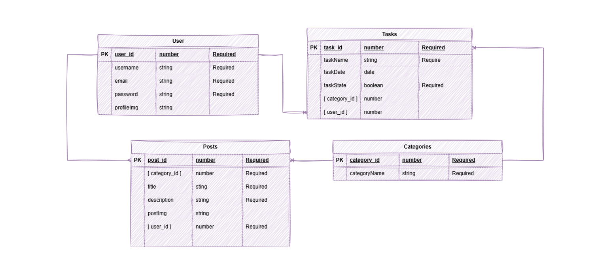
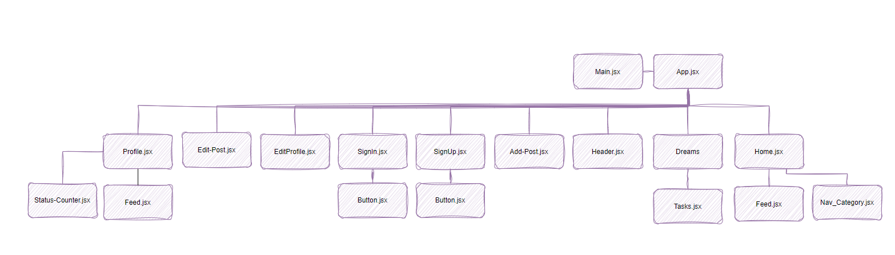
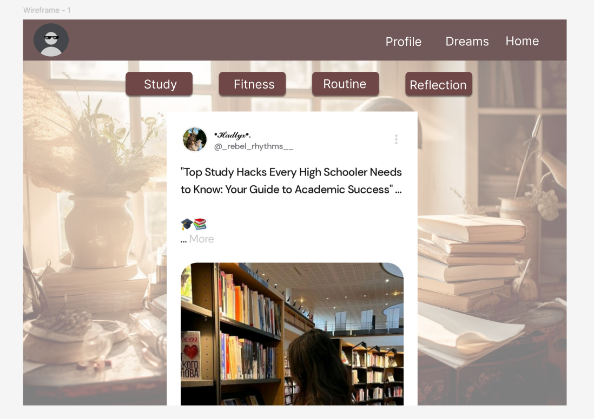

# React + Vite

This template provides a minimal setup to get React working in Vite with HMR and some ESLint rules.

Currently, two official plugins are available:

<<<<<<< HEAD
- [@vitejs/plugin-react](https://github.com/vitejs/vite-plugin-react/blob/main/packages/plugin-react/README.md) uses [Babel](https://babeljs.io/) for Fast Refresh
- [@vitejs/plugin-react-swc](https://github.com/vitejs/vite-plugin-react-swc) uses [SWC](https://swc.rs/) for Fast Refresh
=======
**Project description :** 
---------------------------------------------------
Dreamweave is an intuitive app designed to help users manage their tasks, share updates, and stay organized. Users can create personalized profiles, where they can post content related to various categories such as work, personal goals, or projects.The app offers a clear overview of active tasks and their current state, providing users with the tools to stay productive and on top of their goals. Whether for personal use or collaboration, Dreamweavee helps streamline task management and sharing within a simple and engaging platform.

**Technologies used :**
---------------------------------------------------
- React 
- JSX
- State

**Getting started :**
----------------------------------------------------
 deployed sit link []

[Trello](https://trello.com/invite/b/676bf69b20ad5fa300965e9e/ATTIf6cc6cb3e5213ef90505a3a7c6fd555d8457F81E/dreamweavers)

**Full Entity Relationship Diagram:**
----------------------------------------------------

**Component Hierarchy Diagram:**
----------------------------------------------------

**Wireframe :**
----------------------------------------------------
Sign up / login page :

Home page :

Profile page :

Dreams page : 

**Final product :**
----------------------------------------------------

**Future enhancement :**
----------------------------------------------------
>>>>>>> 553f35f3731106e17b4a06642cd2953221e22faa
